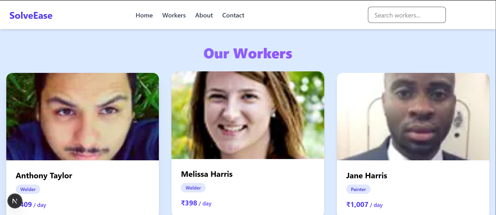
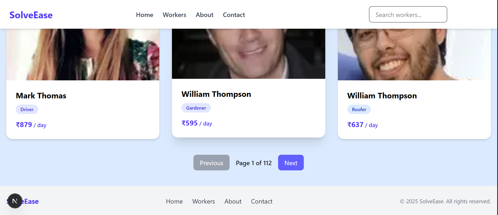

# 🛠️ SolveEase - Frontend Assignment

This project is a **frontend assignment** built as part of the SolveEase Frontend Developer hiring process.
The goal was to enhance the provided starter repo and turn it into a **modern, production-ready frontend app** showcasing **React, Next.js, TypeScript, and Tailwind CSS** skills.

---

## 🚀 Tech Stack

* **Next.js 14 (App Router)**
* **React 18 + TypeScript**
* **Tailwind CSS** for modern styling
* **AOS** for scroll animations
* **Jest + React Testing Library** for unit tests
* **Vercel** for deployment

---

## ⚡ Features Implemented

### Core Features

* 📱 **Responsive UI**: mobile-first design using Tailwind CSS grid system
* 🎨 **Modern card design**: hover effects, spacing, and badges for service types
* 🔍 **Sticky Search Bar**: debounced search for smooth filtering
* 🧩 **Pagination**: Next/Previous buttons with page tracking
* 💸 **Service Filters**: filter workers by `price/day` and service type
* 🖼️ **Skeleton Loading Screens**: placeholder cards while fetching data
* 🌐 **API Integration**: fetched workers data via `/api/workers` route
* ⚡ **Performance Optimizations**: memoization and reduced unnecessary re-renders
* ✨ **Scroll Animations (AOS)** for better user experience

### Extra UI/UX Enhancements

* 🖼️ **Responsive cards layout**: grid adapts to mobile, tablet, desktop
* 🧭 **Sticky Navbar**: navigation bar fixed at top, includes search
* 📜 **Footer**: quick links, branding, and copyright notice
* 🧪 **Unit Testing**: example test for WorkersPage using Jest + React Testing Library

---

## 💻 Getting Started

### 1️⃣ Clone the repo

```bash
git clone https://github.com/manish-kumar/frontend_dev_assignment.git
cd <repo-name>
```

### 2️⃣ Install dependencies

```bash
npm install
```

### 3️⃣ Run the development server

```bash
npm run dev
```

Visit 👉 [http://localhost:3000](http://localhost:3000)

---

## 🧪 Testing

This project uses **Jest + React Testing Library**.

Run tests with:

```bash
npm run test
```

Example test included:

* Renders the **"Our Workers"** heading correctly.

---

## 🚀 Deployment (Vercel)

1. Push your branch to GitHub.
2. Go to [Vercel](https://vercel.com/), import your repository.
3. Configure build settings (Next.js defaults work fine):

   * Build command: `npm run build`
   * Output directory: `.next`
4. Deploy 🚀 and get your live link.

---

## 📸 Screenshots



---

## 👨‍💻 Author

**Manish Kumar**
Frontend Developer | MERN Stack Enthusiast
